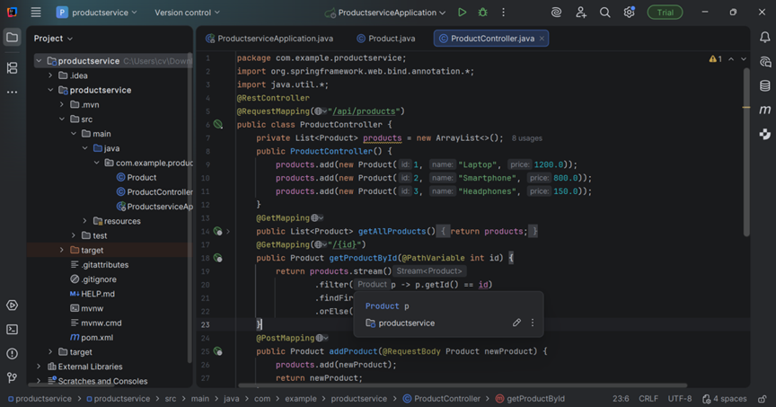
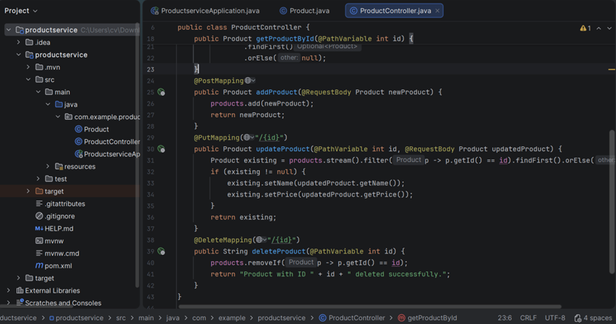

# Java Web Service Development

## 📘 Overview
This project demonstrates **Java Web Service Development** using both **RESTful** and **SOAP-based** architectures.  
It includes three main parts:
1. Building a RESTful API using **Spring Boot**
2. Testing web APIs using **Postman**
3. Creating a SOAP-based web service using **Node.js**

---

## 🎯 Objectives
- Understand Java frameworks for web service development.  
- Implement RESTful endpoints that perform **CRUD operations**.  
- Explore **Postman** for API design and testing.  
- Learn **SOAP** communication, **WSDL**, and XML message structures.  
- Integrate and test multiple web service technologies.

---

## 🧩 Part 1 — Java RESTful Web Service (Spring Boot)

### Implementation Steps
1. Created a new **Spring Boot** project via *Spring Initializr* with dependencies:
   - Spring Web  
   - Spring Boot DevTools  
2. Implemented REST controllers with endpoints:  
   - `/create`  
   - `/read`  
   - `/update`  
   - `/delete`  
3. Added a service layer to handle business logic.  
4. Ran the application on `http://localhost:8080`.  
5. Tested endpoints using **Postman**.

### Tools and Technologies
- Java 17  
- Spring Boot 3.x  
- Maven  
- IntelliJ IDEA  
- Spring Annotations  

### Results
- All CRUD endpoints worked successfully and returned valid JSON responses.  
- Spring Boot handled routing and JSON conversion automatically.  
- API tested successfully via Postman.
 
  
*Figure 1: Product controller implementation using Java.*


---

## 🧪 Part 2 — Web API Design and Testing (Postman)

### Implementation Steps
1. Installed and configured **Postman**.  
2. Created API requests for GET, POST, PUT, and DELETE operations.  
3. Added path/query parameters and JSON payloads.  
4. Verified status codes, headers, and responses.  
5. Saved all requests into a **Postman Collection**.

### Tools and Technologies
- Postman  
- Spring Boot REST API  
- Java 17  
- Maven  

### Outcome
- Validated API workflows and responses.  
- Learned how to debug and manage RESTful APIs efficiently using Postman.
  
  
*Figure 3: Creating and sending GET, POST, PUT, and DELETE requests in Postman.*

---

## ⚙️ Part 3 — SOAP-based Web Service (Node.js)

### Implementation Steps
1. Initialized a **Node.js** project with `npm init`.  
2. Installed required packages:
   - `soap`
   - `express`  
3. Designed a **WSDL** file (`service.wsdl`) defining operations:
   - `sayHello`
   - `addNumbers`
   - `getStudentName`  
4. Created:
   - `server.js` (SOAP server)
   - `client.js` (SOAP client)  
5. Tested SOAP endpoints via **Postman** and console logs.

### Tools and Technologies
- Node.js (v22.19.0)  
- WSDL (XML)  
- npm  
- Express  
- SOAP library  
- Visual Studio Code  

---

## 🧪 Example SOAP Request
```xml
<soapenv:Envelope xmlns:soapenv="http://schemas.xmlsoap.org/soap/envelope/"
                  xmlns:tns="http://example.com/myservice">
  <soapenv:Header/>
  <soapenv:Body>
    <tns:sayHelloRequest>
      <name>World</name>
    </tns:sayHelloRequest>
  </soapenv:Body>
</soapenv:Envelope>
<soap:Envelope xmlns:soap="http://schemas.xmlsoap.org/soap/envelope/"
               xmlns:tns="http://example.com/myservice">
  <soap:Body>
    <tns:sayHelloResponse>
      <greeting>Hello, World!</greeting>
    </tns:sayHelloResponse>
  </soap:Body>
</soap:Envelope>

```
  
*Figure 6: Setting up the SOAP server using Express and the `soap` library.*
  
*Figure 8: Example SOAP request and XML response displayed in Postman.*
